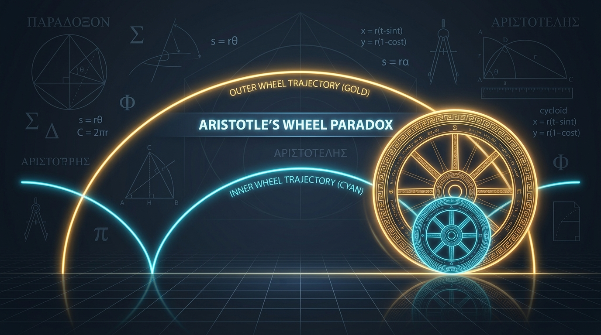
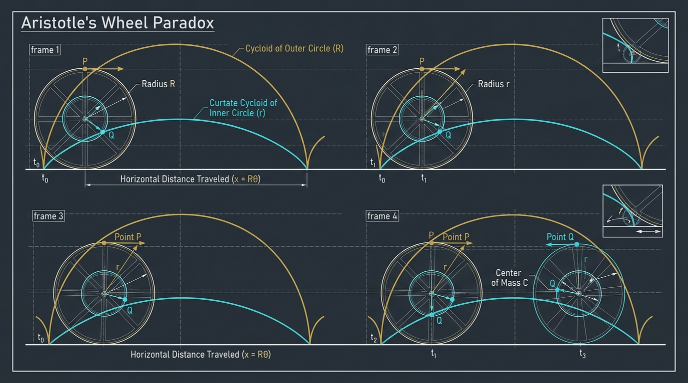
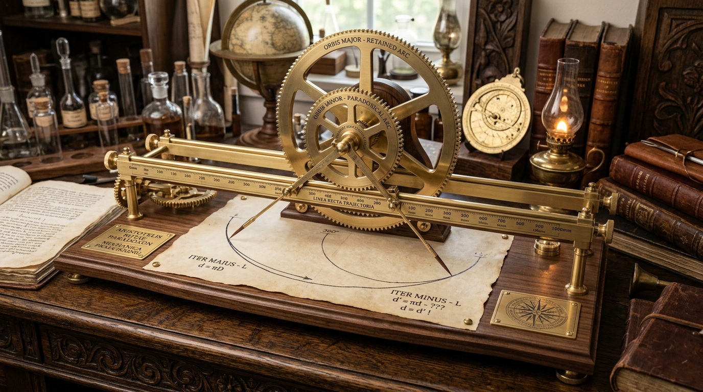
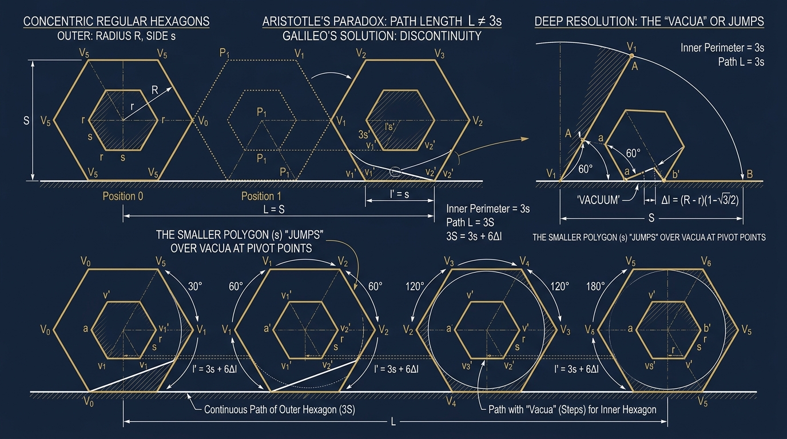
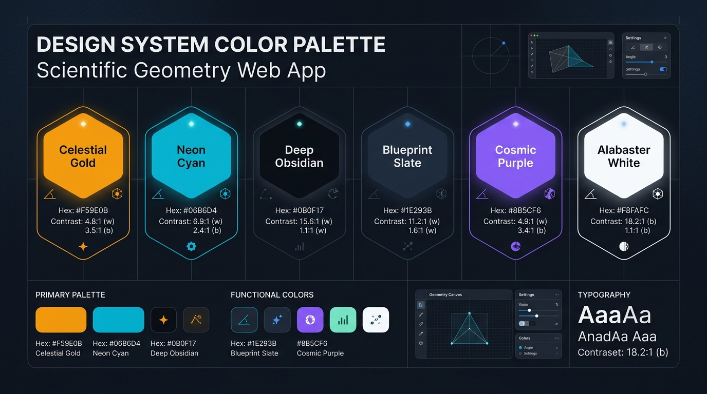
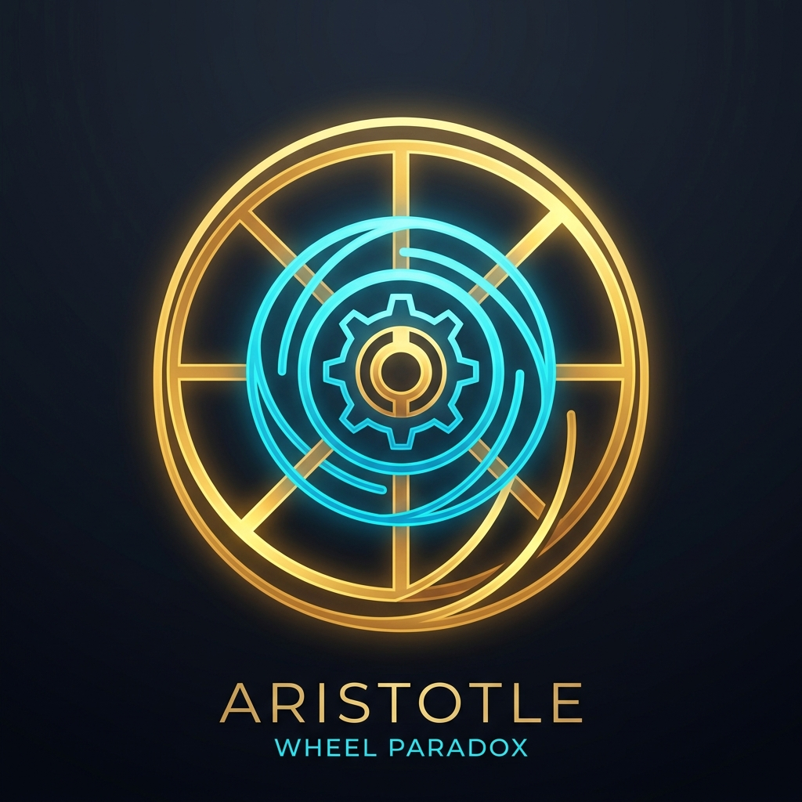

<!--
  ════════════════════════════════════════════════════════════════
  ARISTOTLE'S WHEEL · README
  Crafted by Priyanshu Gupta
  Replace `PriyanshuGupta-Dev/aristotles-wheel` with your repo path.
  ════════════════════════════════════════════════════════════════
-->

<div align="center">



# ⟡ ARISTOTLE'S WHEEL ⟡

### The paradox, rolled out — an interactive essay in a single file.

<br/>

[](https://github.com/PriyanshuGupta-Dev/aristotles-wheel/releases)
[](LICENSE)
[](https://github.com/PriyanshuGupta-Dev/aristotles-wheel)
[](#)

[](#)
[](#)
[](#)
[](#)
[](https://github.com/PriyanshuGupta-Dev/aristotles-wheel/stargazers)
[](#)

</div>

> **“Bind a small circle inside a greater one and roll the pair through a single turn:
> both sweep the same road, though their edges disagree by 2π(R−r).”**
>
> Aristotle noticed. Twenty-three centuries of geometers argued.
> This page rolls the thing out in front of you — and lets you grab the wheel.

---

## ◈ Contents

| | | |
|:---:|:---|:---|
| **01** | [The Paradox, In One Breath](#-the-paradox-in-one-breath) | What breaks, and why it shouldn't |
| **02** | [Motion Study](#-motion-study) | The wheel, frame by frame |
| **03** | [Features](#-features) | Everything the page does |
| **04** | [Gallery](#-gallery) | Plates from the two acts |
| **05** | [Page Map](#-page-map) | Section by section |
| **06** | [Design System](#-design-system) | Palette, type, motion, texture |
| **07** | [The Mathematics](#-the-mathematics) | Three lines that dissolve it |
| **08** | [Architecture](#-architecture) | Engine, structure, performance |
| **09** | [Interaction Catalog](#-interaction-catalog) | Every control, documented |
| **10** | [Quick Start](#-quick-start) | Zero to rolling in 30 seconds |
| **11** | [Customization](#-customization) | Make the wheel yours |
| **12** | [Accessibility & Support](#-accessibility--browser-support) | Built for everyone |
| **13** | [Roadmap & Changelog](#-roadmap) | Where the wheel goes next |
| **14** | [Author & Support](#-author) | Say hello, leave a star |

---

## ◆ The Paradox, In One Breath

Roll a wheel one full turn. The road it covers equals its circumference — that is what
circumference *means*. Now look at the **smaller circle fixed inside it**: in the same turn,
on the same road, it too crosses the entire span… yet its own edge is shorter by `2π(R−r)`.

Two unequal edges. One road. No remainder. **Absurd — until you watch the slip.**

This project resolves the paradox the only honest way: *visually*. The inner circle never
rolls; it **rides**, skidding forward at `(R−r)·ω` the whole journey. The missing length
was never missing — it was smeared across the road as slip, exactly as Galileo suspected
when he counted the voids between polygon lurches.

---

## ◆ Motion Study



> **fig. M** — Frame 01: contact. Frame 02: the two traces separate.
> Frame 03: the slip vector appears. Frame 04: one turn accounted for.

<!-- To embed a live recording, uncomment the line below after adding your GIF:

-->

<details>
<summary><b>🎞 Record your own demo GIF (60 seconds)</b></summary>

<br/>

1. Open the page and scroll to **§02 — The Instrument**.
2. Record with **Kap** (macOS) or **ScreenToGif** (Windows) — 960 px wide, 30 fps.
3. Suggested take: drag the wheel once, flip the *slip vector* toggle, then let it roll.
4. Export as `assets/demo.gif` and uncomment the image line above.

</details>

---

## ◆ Features

**The experience**

- ✧ **Four synchronized canvas scenes** — hero roll, unrolled proof, scrollytelling instrument, polygon machine
- ✧ **Scrollytelling in four phases** — a sticky stage obeys your scroll: construction → contact → passenger → accounting
- ✧ **Grab-the-wheel physics** — pointer-drag the wheel; auto-roll resumes gracefully after 1.4 s
- ✧ **Galileo's polygon limit** — morph nested polygons from 3 to 48 sides, then to ∞, and watch voids multiply past sight
- ✧ **Live measurement ledger** — the `2πR / 2πr / slip` accounting drawn in-scene, per revolution
- ✧ **Click-to-replay proof** — the “one revolution, unrolled” argument re-runs on demand

**The craft**

- ◈ **Zero dependencies, zero build** — one HTML file; view-source is the documentation
- ◈ **Museum-plate design language** — hairline frames, corner ticks, letterpress grain, editorial serif display type
- ◈ **Two-act color script** — a warm paper act and a charcoal act, each with its own accent tuning
- ◈ **Choreographed motion** — staggered scroll reveals, dash-drawn diagrams, a 140 s ambient wheel, scroll-linked progress
- ◈ **Honest engineering** — single `requestAnimationFrame` loop, visibility-gated rendering, DPR-capped canvases
- ◈ **Reduced-motion first-class** — a complete static edition for `prefers-reduced-motion` users

---

## ◆ Gallery



> **fig. A — The Instrument (light act).** Cycloid and curtate cycloid traces, slip vector,
> HUD readout and the per-revolution ledger, live in one frame.



> **fig. B — Polygonize It (dark act).** Nested hexagons mid-lurch; the printed line below
> shows arcs laid down and vermilion-hatched voids left behind.

---

## ◆ Page Map

| § | Section | The experience | Signature detail |
|:---:|:---|:---|:---|
| 00 | **Opening** | Hero plate + live rotation readout in the header | Ambient dashed wheel, 140 s rotation |
| 01 | **The Claim** | One revolution unrolled; outer edge fits, inner edge falls short | Click anywhere on the plate to replay |
| 02 | **The Instrument** | Four-phase scrollytelling + a full tuning bench | Sticky stage, drag-to-roll, live legend |
| 03 | **Polygonize It** | Galileo's limit, dark act, live counters | Void-share and stride-per-lurch readouts |
| 04 | **The Resolution** | Three constraints that dissolve the paradox | Stroke-dash diagrams that draw themselves |
| 05 | **Marginalia** | Twenty-three centuries of readers, as a timeline | Diamond nodes that flip on hover |
| — | **Colophon** | Q.E.D., the identity of the road, and the signature | Hover the footer wheel: one full turn |

---

## ◆ Design System



### Palette

| Swatch | Token | Hex | Role |
|:---:|:---|:---:|:---|
|  | `--surface-primary` | `#F5F3EE` | The paper everything is printed on |
|  | `--surface-elevated` | `#FBFAF6` | Cards, frames, bench |
|  | `--ink-primary` | `#17191E` | Type, hairlines, axle |
|  | `--accent-copper` | `#B3672B` | The **greater** circle · primary accent |
|  | `--accent-lapis` | `#2F5FA8` | The **lesser** circle · secondary accent |
|  | `--accent-vermilion` | `#C63D1F` | Slip, voids, tension |
|  | `--dark-bg` | `#101216` | The dark act |
|  | `--dark-copper` | `#D18A4C` | Dark-act accent tuning |

### Typography

| Role | Family | Weights | Used for |
|:---|:---|:---|:---|
| Display | **Fraunces** | 300 / 400 / 600 + italic | Headlines, ledger numerals, the signature |
| Body | **Instrument Sans** | 400 / 500 / 600 | Prose and interface |
| Data | **IBM Plex Mono** | 400 / 500 / 600 | HUD, tags, formulas, captions, counters |

### Motion

| Element | Behaviour | Specification |
|:---|:---|:---|
| Ambient wheel | Continuous rotation | 140 s · linear · infinite |
| Scroll reveals | Fade + 26 px rise, staggered | 0.9 s · `cubic-bezier(.22,.7,.24,1)` |
| Contact pulse | Expanding ring at the road | 1.4 s · infinite |
| Resolution diagrams | Stroke-dash self-drawing | 1.4 s · 0.25 s delay |
| Timeline nodes | Diamond flip + scale on hover | 0.35 s |
| Brand & footer glyphs | Half / full turn on hover | 0.8 s / 1.0 s |
| Progress rule | Scroll-linked width | Passive listener, 2 px copper |
| Reduced motion | Full static edition | Media query + engine flag |

### Texture & detail

- ◈ Fractal-noise grain overlay at 5 % multiply — paper, not plastic
- ◈ Hairline corner ticks on every frame — drafting-room provenance
- ◈ A fixed datum line and ghost construction circles behind all content
- ◈ Copper selection color, custom scrollbar, letter-spaced mono captions

---

## ◆ The Mathematics

```text
x       = R·θ             the road obeys the outer circle alone
v_slip  = (R − r)·ω       what the inner circle pays, every instant
2πR     = 2πr + 2π(R−r)   the accounting: span = edge + slip
```

<details>
<summary><b>📐 The full derivation, unfolded</b></summary>

<br/>

**1 · One master constraint.** Pure rolling means the contact point is instantaneously at
rest. Only the outer circle touches the road, so the whole body advances at `x = R·θ`.
The inner circle never negotiates with the ground.

**2 · The passenger slides.** A point at radius `ρ` on the axle carries velocity
`R·ω − ρ·ω` at its lowest position. For `ρ = r` this is `(R−r)·ω ≠ 0` — motion where
rolling demands stillness. That is slip, by definition, and its curve is a
**curtate cycloid**:

```text
x(θ) = R·θ − r·sin θ
y(θ) = R   − r·cos θ
```

**3 · The ledger balances.** Integrate the slip over one turn and the “missing” length
appears exactly: `∫ (R−r) dθ = 2π(R−r)`. Equal roads, unequal rolling — reconciled.

**4 · Galileo's limit.** With nested n-gons, stride per lurch is `s = 2R·sin(π/n)` and the
printed line of the lesser wheel is arcs plus voids; void share `= 1 − r/R`, independent
of n. As `n → ∞` the voids become infinitely many, each of measure zero — which is
precisely why the line still measures `2πR`.

</details>

---

## ◆ Architecture

```text
aristotles-wheel/
├── index.html              # The entire experience: markup, design system, engine
├── README.md               # You are here
├── LICENSE                 # MIT
└── assets/                 # README plates (see manifest below)
    ├── 01-banner.png
    ├── 02-motion-study.png
    ├── 03-instrument.png
    ├── 04-polygons.png
    ├── 05-palette.png
    └── demo.gif            # Optional live recording
```

**Inside the engine**

| Module | Responsibility |
|:---|:---|
| `CanvasManager` | DPR-aware sizing via `ResizeObserver`; one context per scene |
| `renderWheel()` | The shared plate renderer: road, traces, brackets, slip, ledger |
| Hero / Claim / Stage / Polygon scenes | Four composers over the shared renderer |
| Polygon machine | Pivot-exact n-gon kinematics with lurch flashes and printed voids |
| Observers | Section visibility gating, scrolly phase switching, scroll reveals |
| Master loop | One `requestAnimationFrame` heartbeat driving only visible scenes |

**Performance notes**

- ⚡ Scenes render **only while visible** — four canvases, one active loop
- ⚡ Device-pixel ratio capped at 2; no retina waste
- ⚡ Trace buffers age-pruned; polygon prints and brackets culled off-screen
- ⚡ Reveals animate `opacity`/`transform` only — no layout thrash
- ⚡ Passive scroll listener; pointer capture for jank-free dragging

---

## ◆ Interaction Catalog

| Control | Type | Effect |
|:---|:---|:---|
| Drag the wheel | Pointer drag | Rotation follows the cursor; auto-roll resumes after 1.4 s |
| Play / Pause · Reset | Buttons | Transport for the instrument |
| Inner radius `r / R` | Slider · 0.35 – 0.92 | Resizes the lesser circle everywhere, live |
| Rolling speed | Slider · 0.2 – 2.2× | Global time scale for every scene |
| Traces · Slip · Ledger | Toggles | Show/hide the three analytic layers |
| Claim plate | Click | Replays the one-revolution unrolled proof |
| Sides slider + chips | 3 – 48 and ∞ | Morphs Galileo's polygon machine |
| Polygon play / pause | Button | Transport for the dark act |

---

## ◆ Quick Start

```bash
# 1 · Clone
git clone https://github.com/PriyanshuGupta-Dev/aristotles-wheel.git
cd aristotles-wheel

# 2 · Serve (any static server — or just double-click index.html)
npx serve .
#   or
python -m http.server 8000

# 3 · Open
# http://localhost:8000
```

No install. No build. No network calls beyond web fonts.
**The wheel is rolling before your coffee cools.**

---

## ◆ Customization

| Knob | Where | Effect |
|:---|:---|:---|
| `--accent-copper` / `--accent-lapis` / `--accent-vermilion` | `:root` | Recolor the greater edge, lesser edge, and slip |
| `--surface-primary` / `--surface-elevated` | `:root` | Repaper the whole edition |
| `State.innerRatio` | Engine §1 | Default `r / R` (0.35 – 0.92) |
| `State.speed` | Engine §1 | Default rolling speed |
| `renderWheel()` options | Engine §3 | Toggle traces, brackets, slip, ledger per scene |
| `.steps` gap | CSS | Scrollytelling pacing |

---

## ◆ Accessibility & Browser Support

- ✔ Semantic landmarks: `header · main · section · aside · footer`
- ✔ Every canvas carries a descriptive `aria-label`
- ✔ Transport buttons expose `aria-pressed`; all controls are native and keyboard-reachable
- ✔ Complete `prefers-reduced-motion` edition: static plates, no autoplay, instant reveals
- ✔ High-contrast ink-on-paper base; copper reserved for meaning, never decoration alone

| Chrome / Edge | Firefox | Safari | Mobile |
|:---:|:---:|:---:|:---:|
| 90+ | 88+ | 14+ | ✔ Full touch drag |

---

## ◆ Roadmap

- [ ] Shareable state via URL parameters (`?r=0.5&n=12`)
- [ ] Export the current plate as PNG
- [ ] Subtle lurch-click sound design for the polygon act
- [ ] Print stylesheet — a museum-plate paper edition
- [ ] Author monogram plate (asset slot reserved)

### Changelog

| Version | Date | Notes |
|:---:|:---:|:---|
| **1.0.0** | 2026-09-16 | Initial release — four scenes, two acts, one paradox dissolved |

---

## ◆ Author

<div align="center">



### Priyanshu Gupta

*Designer & Developer — building instruments that make ideas move.*

[](https://github.com/PriyanshuGupta-Dev)
[](https://www.linkedin.com/)
[](#)

</div>

---

## ◆ If The Wheel Rolled Something In You…

<div align="center">

### ⭐ Star this repository.

Every star greases the axle — and tells me to keep building instruments like this one.

[](https://github.com/PriyanshuGupta-Dev/aristotles-wheel/stargazers)

**1.** Star it &nbsp;·&nbsp; **2.** Fork it &nbsp;·&nbsp; **3.** Send it to someone who loves a good paradox.

<sub>Why readers star it: one file · zero dependencies · real physics · real history ·
a design system worth lifting · reduced-motion respected.</sub>

</div>

---

<div align="center">

**Equal roads, unequal rolling.**

`x = Rθ` &nbsp;·&nbsp; `v_slip = (R−r)ω` &nbsp;·&nbsp; `2πR = 2πr + 2π(R−r)`

**Q.E.D.** — *Quod Erat Demonstrandum*

<sub>© 2026 Priyanshu Gupta · MIT License · Set in Fraunces, Instrument Sans & IBM Plex Mono</sub>

</div>